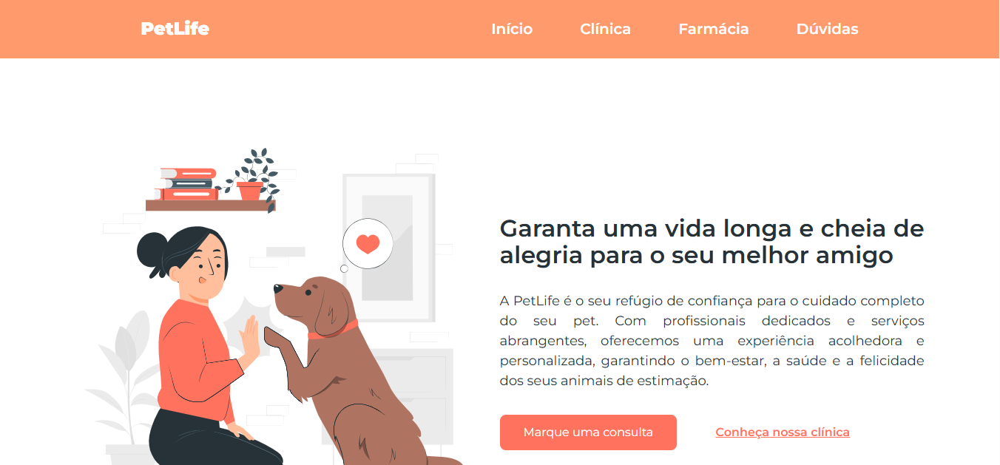

# 🐶 PetLife Landing Page

## 📌 Sobre o Projeto
>A **PetLife** é uma landing page desenvolvida com o objetivo de colocar em prática meus conhecimentos em **HTML**, **CSS** e **JavaScript**, além de aprofundar meu aprendizado em responsividade, boas práticas de código e estruturação de projetos com **Git** e **GitHub**.

[](https://lehcibele.github.io/petlife/)

Este projeto marca o início da minha jornada no desenvolvimento web, sendo o primeiro com versionamento completo usando Git e hospedagem com GitHub Pages.

[Link do mockup](https://www.figma.com/design/ObmGmIUdpg2L4HbgggwcIy/Funil-OBC-Start-2.0?t=KpChIrWbCneCNdNn-0)

## 🚀 Tecnologias Utilizadas

- HTML5  
- CSS3  
- JavaScript
- Git  
- GitHub  
- GitHub Pages

## 🧠 Aprendizados

- Estruturação semântica com HTML  
- Estilização responsiva com CSS (Media Queries)  
- Utilização de variáveis CSS e Flexbox/Grid  
- Animações suaves e efeitos com transições  
- Uso de SVG para efeitos de fundo (como a **onda rosa**)  
- Criação e versionamento de repositórios com Git  
- Deploy utilizando GitHub Pages  

## 📦 Instalação e Execução do Projeto

Caso você queira clonar e rodar este projeto na sua máquina, siga os passos abaixo:

1. Clone este repositório:

   ```bash
   git clone https://github.com/lehcibele/petlife.git
2. Acesse a pasta do projeto:
    ```bahs
    cd petlife
3. Abra o arquivo index.html no seu navegador ou utilize a extensão Live Server do VSCode para visualizar localmente.

## 🌐 Deploy

Este projeto está hospedado no GitHub Pages. Você pode acessá-lo através do link:

👉 

## 📝 Licença

Este projeto está sob a licença MIT. Veja mais em LICENSE.

Desenvolvido com 💙 por Leticia Cibele